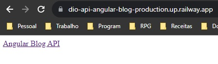

# Lab DIO: API para o Angular Blog
Último desafio do bootcamp Santander Full Stack Java + Angular pela DIO.

* [Sobre o Desafio](#sobre-o-desafio)
    * [Início Modesto](#início-modesto)
* [Modelagem de dados](#modelagem-de-dados)
* [Para Rodar o Projeto](#para-rodar-o-projeto)
* [Deploy no Railway](#deploy-no-railway)
    * [Links do Deploy](#links-do-deploy)

## Sobre o Desafio
O desafio é bem direto: criar uma API e publicacá-la (é sugerido o serviço [Railway](https://railway.app/)).

Como o bootcamp também envolve conhecimentos de Front End com Angular, minha intenção inicial é criar uma API que possa ser usada para manipular no backend os artigos do blog que foi também um desafio neste mesmo bootcamp ([Veja Aqui o repositório do Front End do Angular Blog](https://github.com/Enyus/dio-angular-blog)).

<p align="right"><a href="#"> 🔝 Voltar ao Topo 🔝 </a></p>

### Início Modesto
Primeira coisa que decidi fazer foi fazer com que a chamada para o endpoint ```"/"``` retornasse algo melhor que um erro ```500```, então fiz uma classe ```MainController``` com um método ```home``` que retorna um link (descobri que é possível retornar código html mesmo na mensagem de resposta do controller) para este repositório:

```java
// MainController.java
// Importações
@RestController
public class MainController {
    
    @GetMapping("/")
    public ResponseEntity<Object> home(){
        return ResponseEntity.ok("<a href='https://github.com/Enyus/dio-api-angular-blog'>Angular Blog API</a>");
    }
}
```


<p align="right"><a href="#"> 🔝 Voltar ao Topo 🔝 </a></p>

## Modelagem de dados
O banco de dados provavelmente vai contar com apenas duas tabelas, **Posts** e **Tag**, que podem ser representadas pelo seguinte diagrama:

<p align="center">

</p>

[Diagrama criado com mermaid, conforme sugestão do expert do desafio](https://mermaid.js.org/intro/)

<p align="right"><a href="#"> 🔝 Voltar ao Topo 🔝 </a></p>

## Para Rodar o Projeto
* Garanta que você tem o JDK e o Maven instalados ([Para um guia mais descritivo, pelo menos usando Windows e o VSCode, veja esse repositório](https://github.com/Enyus/lab-dio-padrao-projeto-java#java-no-vscode));
* No diretório principal (```angular.blog.api```), rode o comando ```mvn install``` para instalar todas as dependências do arquivo ```pom.xml```;
    * É recomendável usar o comando ```mvn clean``` antes do comando de instalação;
* Execute o comando para incializar a API ```mvn spring-boot:run``` e o aplicativo começará a rodar na porta 8080, rota ```http://localhost:8080/```;
* Para entrar no console do banco de dados em memória H2, acesse a rota ```http://localhost:8080/h2-console/``` com os dados de ```application.yaml```:
    * JDBC URL: *jdbc:h2:mem:angularblogapi*
    * User Name: *enyus*
    * Password: "" (deixar vazio)
    * Clicar em ```Connect```.
* Para rodar o ```swagger UI```, basta acessar a url ```http://localhost:8080/swagger-ui.html```.

<p align="right"><a href="#"> 🔝 Voltar ao Topo 🔝 </a></p>


## Deploy no Railway
Depois de suar muito para conseguir fazer o deploy no [Railway](https://railway.app/), finalmente consegui e tudo graças ao [vídeo](https://www.youtube.com/watch?v=tSyzZbIE3WU) e [post no medium](https://medium.com/@gustavoalberttodev/como-fazer-deploy-de-uma-api-maven-springboot-tomcat-no-railway-app-8ceecae97b6d) do [Gustavo Alberto Souza Costa](https://github.com/GA9BR1).

Minha dificuldade veio principalmente do fato que a explicação do especialista da DIO não apenas era em outra IDE (tive sérios problemas em usar variáveis de ambiente em java com o VSCode, não consegui pra falar a verdade), mas também usava o **graddle** como gerenciador de pacotes.

Alterações:
* Criei uma branch específica para o deploy;

* No arquivo da classe principal (```Application.java```), foi adicionada a propriedade ***PORT*** que descreveria a porta usada pelo Railway para subir a aplicação;
```java
// Importações
public class Application {
	public String PORT = System.getenv("PORT");

	public static void main(String[] args) {
    // (...)
```

* Como o Railway usa docker, o Gustavo indicou a criação de um arquivo chamado ***Dockerfile*** que indica ao Docker os passos a seguir para subir a API;
```Dockerfile
FROM openjdk:17 #indica que estou usando o java na versão 17
ADD ./docker-spring-boot.jar docker-spring-boot.jar #nome final do arquivo de inicialização, definido no arquivo pom.xml
ENTRYPOINT  ["java", "-jar", "docker-spring-boot.jar"] # aqui imagino que sejam os comandos para iniciar o aplicativo "buildado"
```

* Como mencionado no item anterior, o nome final do arquivo de build deve ser declarado no arquivo pom.xml, em ```<build>```:
```xml
<!-- pom.xml -->
<build>
    <plugins>
        <plugin>
            <groupId>org.springframework.boot</groupId>
            <artifactId>spring-boot-maven-plugin</artifactId>
        </plugin>
    </plugins>
    <finalName>docker-spring-boot</finalName>
</build>
<!-- pom.xml -->
```

* No arquivo de propriedades, que no meu caso eu uso o ```application.yaml```, foi adicionada a propriedade informando a porta:
```yaml
spring:
    # (...)
    server:
        port: ${PORT:8080}
```

* Realizando o procedimento padrão quando o arquivo *pom.xml* é alterado, rodou-se os comando ```mvn clean``` e ```mvn install``` no terminal, o que gera a pasta **target**. Dentro dela, o arquivo final (anteriormente denominado) ```docker-spring-boot.jar``` foi criado. Este arquivo foi copiado para a raiz do projeto.

* Com um push para o GitHub, que eu já havia sincronizado com o railway e configurado as variáveis de ambiente no site, o deploy subiu e funcionou!



### Links do Deploy
* Raiz: https://dio-api-angular-blog-production.up.railway.app
* Swagger: https://dio-api-angular-blog-production.up.railway.app/swagger-ui.html

<p align="right"><a href="#"> 🔝 Voltar ao Topo 🔝 </a></p>