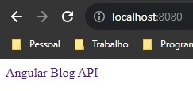

# Lab DIO: API para o Angular Blog
Último desafio do bootcamp Santander Full Stack Java + Angular pela DIO.

* [Sobre o Desafio](#sobre-o-desafio)
    * [Início Modesto](#início-modesto)
* [Modelagem de dados](#modelagem-de-dados)
* [Para Rodar o Projeto](#para-rodar-o-projeto)

## Sobre o Desafio
O desafio é bem direto: criar uma API e publicacá-la (é sugerido o serviço [Railway](https://railway.app/)).

Como o bootcamp também envolve conhecimentos de Front End com Angular, minha intenção inicial é criar uma API que possa ser usada para manipular no backend os artigos do blog que foi também um desafio neste mesmo bootcamp ([Veja Aqui o repositório do Front End do Angular Blog](https://github.com/Enyus/dio-angular-blog)).

<p align="right"><a href="#"> 🔝 Voltar ao Topo 🔝 </a></p>

### Início Modesto
Primeira coisa que decidi fazer foi fazer com que a chamada para o endpoint ```"/"``` retornasse algo melhor que um erro ```500```, então fiz uma classe ```MainController``` com um método ```home``` que retorna um link (descobri que é possível retornar código html mesmo na mensagem de resposta do controller) para este repositório:

```java
// MainController.java
// Importações
@RestController
public class MainController {
    
    @GetMapping("/")
    public ResponseEntity<Object> home(){
        return ResponseEntity.ok("<a href='https://github.com/Enyus/dio-api-angular-blog'>Angular Blog API</a>");
    }
}
```



<p align="right"><a href="#"> 🔝 Voltar ao Topo 🔝 </a></p>

## Modelagem de dados
O banco de dados provavelmente vai contar com apenas duas tabelas, **Posts** e **Tag**, que podem ser representadas pelo seguinte diagrama:

<p align="center">

</p>

[Diagrama criado com mermaid, conforme sugestão do expert do desafio](https://mermaid.js.org/intro/)

<p align="right"><a href="#"> 🔝 Voltar ao Topo 🔝 </a></p>

## Para Rodar o Projeto
* Garanta que você tem o JDK e o Maven instalados ([Para um guia mais descritivo, pelo menos usando Windows e o VSCode, veja esse repositório](https://github.com/Enyus/lab-dio-padrao-projeto-java#java-no-vscode));
* No diretório principal (```angular.blog.api```), rode o comando ```mvn install``` para instalar todas as dependências do arquivo ```pom.xml```;
    * É recomendável usar o comando ```mvn clean``` antes do comando de instalação;
* Execute o comando para incializar a API ```mvn spring-boot:run``` e o aplicativo começará a rodar na porta 8080, rota ```http://localhost:8080/```;
* Para entrar no console do banco de dados em memória H2, acesse a rota ```http://localhost:8080/h2-console/``` com os dados de ```application.yaml```:
    * JDBC URL: *jdbc:h2:mem:angularblogapi*
    * User Name: *enyus*
    * Password: "" (deixar vazio)
    * Clicar em ```Connect```.
* Para rodar o ```swagger UI```, basta acessar a url ```http://localhost:8080/swagger-ui.html```.

<p align="right"><a href="#"> 🔝 Voltar ao Topo 🔝 </a></p>